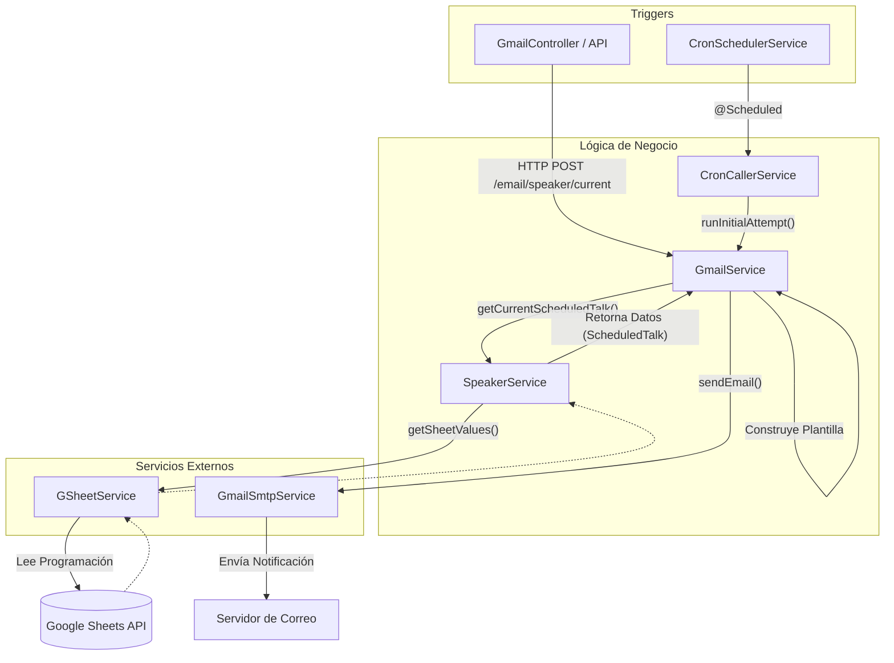
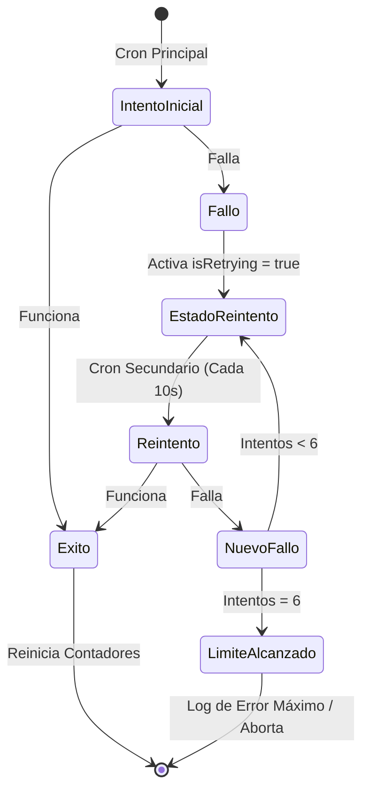

# Speaker Reminder 📅 🎤

**Speaker Reminder** es una aplicación de backend diseñada para automatizar el envío de recordatorios a los discursantes (speakers) de una congregación o evento. La aplicación extrae la información de los discursantes programados desde un documento de Google Sheets y envía notificaciones por correo electrónico de manera automática o mediante peticiones manuales a su API.

---

## 🛠 Tecnologías Utilizadas

Este proyecto está construido con las siguientes tecnologías:

*   **Java 25**: Lenguaje de programación principal.
*   **Spring Boot 4.0.5**: Framework base para la aplicación (incluyendo Spring Web, Spring Batch y Spring Boot Mail).
*   **Maven**: Gestor de dependencias y construcción del proyecto.
*   **H2 Database**: Base de datos en memoria.
*   **Lombok**: Para reducir el código repetitivo en Java.
*   **Google API Client (Sheets)**: Para leer la programación de los discursantes directamente de Google Sheets.
*   **Docker & Docker Compose**: Para empaquetar y ejecutar fácilmente la aplicación y sus dependencias.

---

## 🚀 Cómo Ejecutar Localmente

### Prerrequisitos
- Tener configurado un archivo `.env` en la raíz del proyecto basándose en las variables requeridas (como `CONGREGATION_ADDRESS`, `CRON_EXPRESSION`, credenciales SMTP `MAIL_*`, claves de la API de Google, etc.).
- Java 25 y Maven (si se ejecuta sin Docker).
- Docker y Docker Compose (si se ejecuta con contenedores).

### Opción 1: Usando Docker Compose (Recomendado)
El proyecto incluye un entorno Docker listo para compilar y ejecutar el proyecto:
```bash
# Compilar y levantar la aplicación
docker-compose up -d
```
El contenedor `mvn-build` empaquetará la aplicación primero, y luego el contenedor `api` iniciará el servidor en los puertos `8080` y `8081`.

### Opción 2: Usando Maven Localmente
Si deseas correrlo de manera local sin Docker:
```bash
# Compilar y arrancar con Spring Boot
./mvnw clean spring-boot:run
```
*(Asegúrate de que las variables de entorno de tu terminal estén configuradas o cargadas en tu IDE).*

---

## 🔄 Flujo de Ejecución de la API

A continuación, se muestra un diagrama detallando cómo se ejecuta el flujo principal de recordatorios en la aplicación:



### Explicación del Flujo:
1. **Disparador (Trigger)**: El proceso puede iniciarse de dos maneras:
   - **Automáticamente** mediante una tarea programada (`CronSchedulerService`) que llama al intento inicial del cron.
   - **Manualmente** mediante una llamada al endpoint expuesto por los Controladores de la API (ej. `GmailController`).
2. **Procesamiento de Email**: El `GmailService` toma la solicitud e invoca al servicio de discursantes.
3. **Obtención de Datos**: El `SpeakerService` pide al `GSheetService` que lea los datos de la semana actual desde la API de Google Sheets.
4. **Envío del Recordatorio**: Si se encuentran datos válidos, se genera la plantilla de correo y se envía mediante `GmailSmtpService`. En caso de que el discursante no tenga correo registrado, se notifica al coordinador o supervisor.

---

## 🔁 Sistema de Reintentos (Retry Mechanism)

Dado que la aplicación depende de servicios externos (API de Google Sheets y un servidor SMTP), es susceptible a fallos transitorios de red. Para asegurar que el recordatorio sea enviado, el sistema cuenta con una robusta política de reintentos en memoria gestionada de la siguiente manera:

- **Intento Inicial (`weeklyReminderTask`)**: El `CronSchedulerService` dispara el primer intento según la expresión cron configurada. Si este intento falla, se activa el estado de reintento a través de `RetryOnMemoryService`.
- **Tarea de Reintento (`retryTask`)**: Existe otra tarea programada de forma independiente que se ejecuta cada **10 segundos**. Esta tarea evalúa de forma continua si existe un estado de fallo e invoca a `CronCallerService.runNextAttempt()`.
- **Lógica de Control (`RetryOnMemoryService`)**:
  - Si un intento tiene éxito, los contadores se limpian y se desactiva el estado (`isRetrying = false`, `attempts = 0`).
  - Si vuelve a fallar, el contador de intentos aumenta. El control de estado se maneja usando clases atómicas en memoria (`AtomicInteger` y `AtomicBoolean`) para garantizar que la verificación sea a prueba de fallos de concurrencia.
  - El sistema intentará recuperarse hasta un **máximo de 6 veces**. Tras alcanzar este límite, la ejecución de reintento se detendrá hasta el siguiente evento del Cron principal.


